# 🛡️ EtherX: The AI-Powered Web Application Firewall

> **Winner Material** | **Zero-Day Protection** | **Transformer-Based**

EtherX is a Next-Gen WAF that ditches static rules for a **DistilBERT Transformer Brain**. It learns the "grammar" of your application's traffic and instinctively blocks anomalies, protecting you from threats you haven't even seen yet.

## 🌟 Why EtherX?

- **🧠 Big Brain AI**: Uses specific `DistilBERT` tokens to understand HTTP semantics.
- **⚡ Blazing Fast**: Optimization for sub-10ms inference.
- **👀 Real-Time Dashboard**: Watch attacks getting smashed live.
- **🛡️ Zero-Config**: No regex rules to write. Just train and defend.

## 🚀 Quick Start (Demo Mode)

We built a **One-Click Demo Script** for the hackathon judges.

```bash
# 1. Setup Vulnerable App & WAF
./demo.sh
```

_This will start the Server, the WAF, and run a live attack simulation._

### 🖥️ Access the Dashboard

Once running, open your browser to:
**[http://localhost:8000/dashboard](http://localhost:8000/dashboard)**
_See live traffic stats and attack blocks!_

## 🏗️ Architecture

```mermaid
graph LR
    User[User/Hacker] -->|Request| WAF[🛡️ EtherX WAF]
    WAF -- Safe --> App[✅ Protected App]
    WAF -- Attack --> Block[🚫 Blocked 403]
    WAF -->|Logs| Dashboard[📊 Live UI]
    Model[🧠 DistilBERT] -.-> WAF
```



## 🛠️ Tech Stack

- **AI Core**: PyTorch, HuggingFace Transformers
- **Engine**: FastAPI, Uvicorn (Async High Performance)
- **Target**: Python/FastAPI (Mock E-commerce)

## 🧙‍♂️ For the Nerds: How it works

1.  **Tokenization**: We convert HTTP requests into vector embeddings.
2.  **Perplexity Analysis**: The model calculates how "surprised" it is by a request.
3.  **Thresholding**: If `Perplexity > 20`, it's an anomaly (Attack).

---

_Built with ❤️ for the Hackathon_
